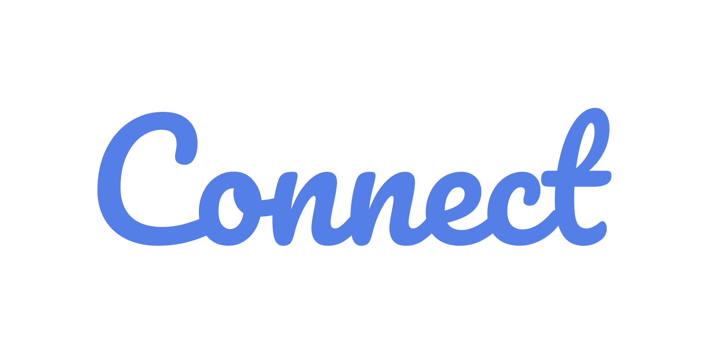

## Table of contents
- [App Video](#app-video)
- [Project Description](#project-description)
- [Fonts Used](#fonts-used)
- [Plugins and Packages](#plugins-and-packages)
- [Features](#features)

## App Video

https://github.com/MinaAnis7/Connect-Flutter/assets/89950065/c1a3ad63-63f5-4f2f-a999-4436b8513aa3

## Project Description
- **Connect** is a social media app that lets you connect with those you want to connect to.
- It lets you share your ideas and have chats with your friends.
- Customize your profile.
- It has a **Dark Mode** Feature!
- **Connect** Uses **FireBase** as its Back-end to help you Authenticate, save your posts, and save the data you want.
- It Uses **Flutter BLoC** as a state management system.

## Fonts Used
- Pacifico
- Poppins

## Plugins and Packages
- hexcolor
- flutter_screenutil
- flutter_bloc
- bloc
- firebase_core
- firebase_auth
- motion_toast
- cloud_firestore
- conditional_builder_null_safety
- shared_preferences
- fluttertoast
- font_awesome_flutter
- readmore
- firebase_storage
- image_picker
- path_provider
- page_transition
- emoji_picker_flutter
- intl
- google_sign_in
- flutter_launcher_icons

## Features
- **Splash Screen:** Firstly, When you open the app you will land on Connect Splash Screen.
- **Authentication:** You can Login or Sign-up with your *email and password* **or** with your *Google* Account.
- **News Feed:** Here, You can see the posts that your connections made and are sorted based on date and time.
- **Create Post:** You Can Create Your Own Post and Share your own thoughts and feelings. You Can add a post image and some tags. Adding a tag is easier than you think with Connect, as you can type your tag with spaces and those spaces (and any special character) will be replaced with underscores.
- **Delete Post:** You can only delete your created posts in your profile.
- **Love and Comment:** You Can Love and Comment on any post you want, **see** all the comments, and **see** who loved the post.
- **Read More:** If the post contains more than 3 lines, you can press on read more to see the whole post.
- **Search:** You can search for any user registered in the app **or** within your chats.
- **Chats:** You can chat with your connections in real-time and insert emojis.
- **Connections:** You can make connections by sending a connection request to them. Once they approve the request, you are friends and now you can see your posts and have chats!
- **Notifications:** Connect can inform you (within the app) who sent a request to you and if the request that you sent was accepted.
- **Profile Customization:** You can edit your profile and have a new profile and cover images. and edit your name, phone, or your bio.
- **User Profiles:** You can see others' profiles and see their own posts.
- **Dark Mode:** Connect has a Dark Mode Feature to make you comfortable browsing it.

If you feel like you want to donate, here's my PayPal email: minapp30@Gmail.com
